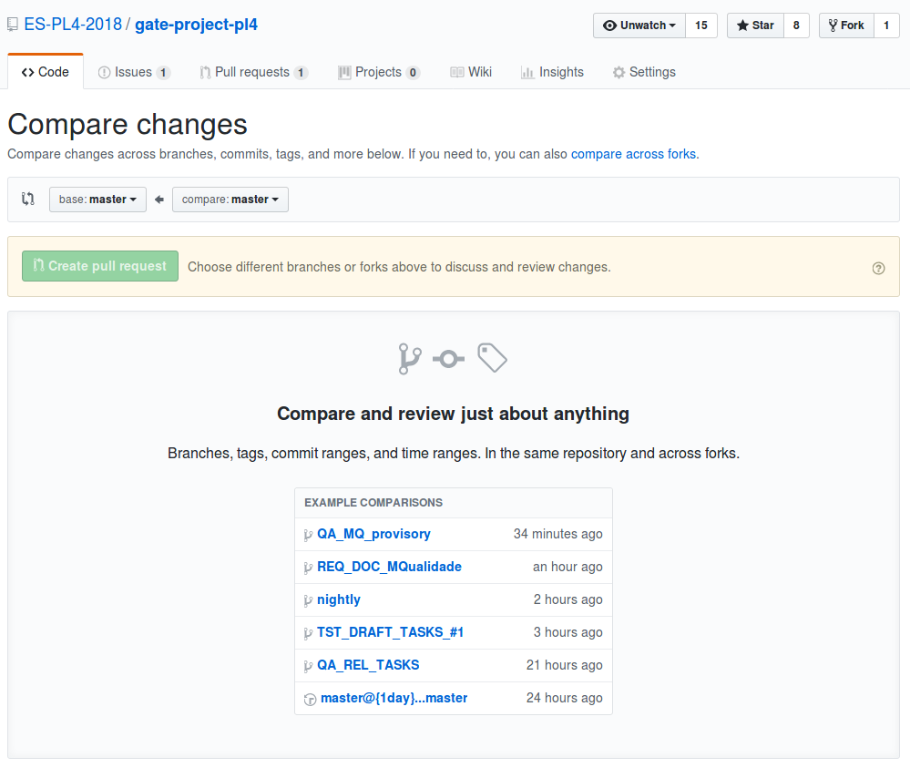

# **Manual de Workflow Github**
## **Unidade de Ambiente (ENV)**
| Disciplina: ENV | Data: 24/09/2018 | Coordenador: Victor Carvalho |
| - | - | - |
| **Estado:** Completo | **Versão** v2.0 |

| Revisão | Responsável |
| - | - |
| 1.0 | Victor Carvalho | 
| 2.0 | Victor Carvalho |

## **Setup**
### **Command Line Interface**
| Platorm | Download |
| - | - |
| Windows | [Link](https://gitforwindows.org/) |
| MacOS | [Link](https://git-scm.com/download/mac) |
| Linux | [Link](https://git-scm.com/book/en/v2/Getting-Started-Installing-Git)

### **GUI**
| Nome | Plataformas suportadas | Link |
| - | - | - |
| Git Kraken | Windows, Mac, Linux | [Link](https://www.gitkraken.com/) |
| Github Desktop | Windows, Mac | [Link](https://desktop.github.com/) |

Alguns IDE e editores de texto possuem integração. Verifique o website da ferramenta de sua escolha.

## **Introdução**
O `Git` é um VCS, _Version Control System_, poderoso que permite ver as mudanças que foram feitas, ver quem as fez, quando foram feitas e porquê. O `Git` permite poupar tempo, trabalhar _offline_, desfazer erros e realizar mudanças rápidas. É uma ferramenta completa e muito útil enquanto desenvolvimento de software.

## **Sobrevivência no Git**
### **Clonar o repositório**
Cria uma cópia funcional de um repositório remoto:
`git clone https://url/to/repository`

#### **Workflow**
O seu repositório local consiste em três árvores que são manuseadas pelo `git`. 

A primeira é o `Working Directory` que mantém as mudanças feitas num ficheiro. 

A segunda é o `Index` que age como a área de _Staging_. 

Finalmente, a `HEAD` que aponta para o último commit que foi feito por si.

### **Add e Commit**
Você pode propor mudanças (adicioná-las ao index) usando

`git add <nome-ficheiro>`

`git add *`

Este é o primeiro paço num workflow básico de git. Para realmente cometer essas mudanças use

`git commit -m "Mensagem do Commit"`

Agora o arquivo foi _committed_ para a `HEAD` mas ainda não está no repositório remoto.

### **Enviando mudanças**
Suas mudanças agora estão na _HEAD_ da sua cópia local. Para mandar essas mudanças para o repositório remoto, execute

` git push origin master`

E mude **_master_** para qualquer _branch_ que desejas enviar suas mudanças.

## **Branching**
Uma das maiores vantagens do Git é sua capacidade de ramificação. Ao contrário de VCS's centralizados, o Git permite ramificar usando **_branches_**. Git branches são simples de juntar e gerir. Isto facilita o feature branch workflow que é popular entre tantos usuários do Git e que também usaremos.

_Branches_ são usadas para desenvolver funcionalidades (ou documentação) isoladas umas das outras. A branch _master_ é a branch "padrão" quando cria-se o repositório.

**_Feature branches_** proporcionam um ambiente isolado para fazer mudanças no repositório, sejam essas mudanças relacionadas à documentação ou código. Quando um colaborador deseja trabalhar em algo - não importa o quão grande ou pequeno - cria-se uma nova branch. Isso garante que a _master branch_ sempre contém código com qualidade de produção.

Usar **_feature branches_** não é só mais fiável que editar diretamente código de produção mas também proporciona benefícios organizacionais. Elas permitem representar o trabalho de desenvolvimento com a mesma granularidade do acúmulo do trabalho feito em técnicas de desenvolvimento _agile_.

### **Como as _branches_ do projeto estão organizadas?**
#### **Master**
Contém todo o código, os testes e a documentação **finalizados**. É a acumulação de todo o trabalho feito pela equipa e pronto para ser avaliado.

#### **Nightly**
É a principal branch de desenvolvimento. As _features branches_ de funcionalidade partem daqui e seguem o desenvolvimento até que estejam prontas para serem novamentes juntas à branch **nightly**. Estas _features branches_ são _merged_ via **Pull requests**.

#### **Testing**
Principal branch de testes. A branch `nightly` é merged para a branch `testing` e começa-se os procedimentos da unidade de Teste.

#### **QA**
Principal branch de redação de documentos. Todas os documentos são redigidos em uma branch do modo que melhor couber a cada unidade. Quando os documentos redigidos estiverem prontos abre-se um **Pull request** para a branch de QA validar e aprovar os documentos criados de acordo com os processos da unidade e o Manual de Qualidade.

### **Pull Requests and Merging Branches**

Aqui podemos fazer o merge entre branches. Pull requests têm o objetivo de informar outros sobre as mudanças que foram feitas por si para uma branch num repositório no Github. Assim que um Pull request é aberto, pode-se revisar e discutir as mudanças feitas por cada colaborador e podemos adicionar _commits_ antes das mudanças serem aceitas e _merged_ para a _branch_ de base.

Pull requests também têm o benefício de serem automaticamente checadas pela qualidade de código e os serviços de integração contínua que foram integrados ao repositório, que dão a segurança extra de sabermos que as mudanças feitas seguem um padrão de qualidade esperado e não possuem mudanças com defeitos.

Para além disto, as Pull resquests são uma extensão de vários processos definidos por cada equipa e ajudam a formaliza-los.

# Tags
As tags serão usadas tanto para Issues e nomes de branches para melhor indentificação do trabalho que está sendo feito e a quem este trabalho interessa de um modo geral.

| Equipa/Assunto  | Tag |
| --- | --- |
| Gestão| GES |
|Requisitos   | REQ  |
|Implementação   |IMP |
|Testes   | TST  |
|Qualidade   | QUA  |
|Ambiente   |ENV   |
|Projeto   |PROJ |
|Hotfix   |HTF   |  

# **Issues**

Servem para termos discussões formais sobre a documentação, atas e problemas no código. Organizando cada issue com as tags corretas temos separação entre equipas.

  

*   Uma pessoa pode ser assinalada como responsável pela resolução de uma issue
*   Fácil comunicação entre a equipa via @mention da equipa

As issues servem também como métrica para tracking do progresso de cada equipa, portanto é necessário.

  

# **Recursos**  

1.  [Git cheat Sheet  
    ](https://www.git-tower.com/blog/git-cheat-sheet/)
2.  [Tutorial de Git interativo](https://learngitbranching.js.org/)  
    
3.  [Git handbook](https://guides.github.com/introduction/git-handbook/)
4.  [Visualizando git](http://git-school.github.io/visualizing-git/)  
    
---

## **FAQ**  

### **Consigo escrever patches se não pertenço a uma equipa?**  

Sim. As restrições impostas não impedem a criação de uma branch baseada numa das 3 principais. O workflow todo é a base de merges e Pull requests e estes estão disponíveis a todos os integrantes do projeto.
