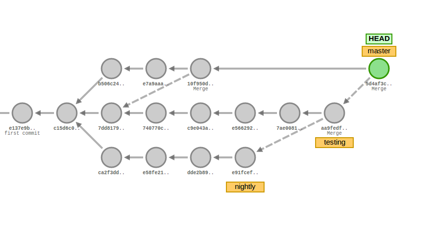

# **Branching**  

O projeto possui 3 branches principais com vida de longo prazo

## **Master**

Branch principal. Todo o código desenvolvido e testado com build passing é automaticamente lançado no servidor. Hotfixes e documentações são _branched_ _off_ a partir do master e serão reincoporados via _Pull requests (PR). _Branches de documentação seguem o seguinte esquema de nome:

```TEAM_TAG-DOC-BRANCH_NAME```


Se a equipa de requisitos precisar de um novo documento, usuaria o seguinte nome:  

```REQ-DOC-atualizacao_requisitos```

Hotfixes serão casos especiais no desenvolvimento em que uma falha (bug) no sistema deve ser imediatamente corrigida e fora do processo normal de desenvolvimento, dado a urgência da mesma. Estes casos também serão _branched off _a partir do Master e seguem o seguinte esquema de nome:

```HTF-fix_description```

Toda a documentação deve ser escalonada para _merges, _sendo sugerido cada domingo e quarta-feira os dias ideais. Isto porque cada equipa precisa de tempo para as revisões dos documentos e devida confirmação do resto da equipa para obedecer os processos estabelecidos.

Hotfixes, entretetanto, serão _merged _assim que o coordenador de testes ou implementação derem confirmação.

Apenas os coordenadores de cada equipa possuem privilégios de escrita padrões neste branch.  

## **Testing**

Branch da equipa de testes. Todo o código desenvolvido é merged para a branch de testes com a aprovação do coordenador de testes ou implementação. As _features_ implementadas pela equipa de desenvolvimento serão testadas e assim que garantirem o nível de qualidade esperado serão fundidas à _branch_ Master. 

  

Para melhor organização de desenvolvimento dos testes segue-se a seguinte prática: criar _short-lived branches_ que possuem o foco específico em testar uma feature apenas e realizar um _merge_ entre esta _short-lived branch_ e a branch Testing. Por exemplo se pretendo testar a _feature_A _criaria a branch:

```TST-feature_A```

E o desenvolvimento dos testes viveria nesta branch até o merge  com a branch Testing.

  

Apenas a equipa de Testes possui privilégios de escrita padrões neste branch.

## **Nightly**

Branch de desenvolvimento. Todo o código desenvolvido é escrito primariamente aqui, sendo o workflow desta branch semelhante ao de testing. Isto é,  criar _short-lived branches _que possuem o foco específico em desenvolver uma feature apenas e realizar um _merge _entre esta _short-lived branch _e a branch Nightly quando está feature estiver implementada corretamente. Se quero desenvolver _feature_C, _criaria a branch:  

```DEV-feature_C```

E o desenvolvimento dos feature viveria nesta branch até o merge com a branch Nightly.

Apenas a equipa de Desenvolvimento possui privilégios de escrita padrões neste branch.

## Exemplo duma possível árvore de commits


## Número de reviews mínimas
A política de que todos os commits hão de ser feitos numa branch não protegida e submetida via _pull request_ está em vigor.

A branch Master possui mínimo de duas reviews, para a gestão ter sempre tracking do que esta sendo feito em cada equipa. Um integrante da equipa de gestão adicional ao líder pode ser adicionado (contatar a equipa de ambiente).

A branch Testing tem duas aprovações mínimas. Uma para o coordenador e outro tester que não submeteu o patch para revisão extra.

A branch Nightly possuí mínimo de duas aprovações, ambas para review da feature desenvolvida.

# **Tags**

As tags serão usadas tanto para Issues e nomes de branches para melhor indentificação do trabalho que está sendo feito e a quem este trabalho interessa de um modo geral.

Gestão
|Equipa/Assunto   | Tag  |
|---|---|
|Gestão   | GES  |
|Requisitos   | REQ  |
|Implementação   |DEV  |
|Testes   | TST  |
|Qualidade   | QA  |
|Ambiente   |ENV   |
|Projeto   |PROJ |
|Hotfix   |HTF   |  

# **Issues**

Servem para termos discussões formais sobre a documentação, atas e problemas no código. Organizando cada issue com as tags corretas temos separação entre equipas.

  

*   Uma pessoa pode ser assinalada como responsável pela resolução de uma issue
*   Fácil comunicação entre a equipa via @mention da equipa

As issues servem também como métrica para tracking do progresso de cada equipa, portanto é necessário.

  

# **Recursos**  

1.  [Git cheat Sheet  
    ](https://www.git-tower.com/blog/git-cheat-sheet/)
2.  [Tutorial de Git interativo](https://learngitbranching.js.org/)  
    
3.  [Git handbook](https://guides.github.com/introduction/git-handbook/)
4.  [Visualizando git](http://git-school.github.io/visualizing-git/)  
    

  
---

## **FAQ**  

### **Consigo escrever patches se não pertenço a uma equipa?**  

Sim. As restrições impostas não impedem a criação de uma branch baseada numa das 3 principais. O workflow todo é a base de merges e Pull requests e estes estão disponíveis a todos os integrantes do projeto.